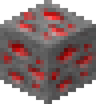
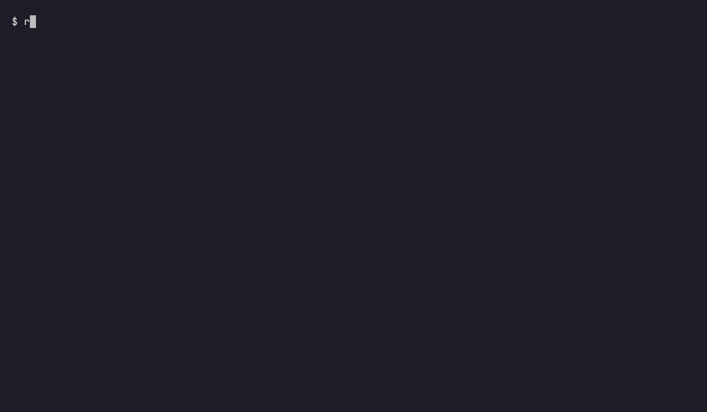

<p align="center">
  
</p>

<h1 align="center">redstone</h1>

<p align="center">
  <a href="https://github.com/Providence-Crafts/redstone/releases/latest"></a>
</p>

A drop-in replacement for `sqlite3(1)` with zsh-style completion, live syntax
highlighting, a colour theme system, and output worth looking at.

`redstone --compat` reproduces `sqlite3(1)` exactly — same dot commands, same
output modes, same command-line flags — verified byte-for-byte by a
differential test suite against the real binary. Outside `--compat`, redstone
adds a navigable completion menu (`<Tab>` for tables, columns, dot commands,
values), highlighting of the statement as you type, and box-drawn, coloured,
terminal-width-aware output by default.

See `man redstone` (`docs/redstone.1`) for the full reference: every flag, every
output mode, file locations, environment variables and exit status. This file
is the tour.

<p align="center"></p>

## Install

Every [release](https://github.com/Providence-Crafts/redstone/releases) carries
a ready-to-run executable for each platform, plus an archive that adds the man
page, README and licence. SQLite is compiled in; there is nothing else to install.

**Linux**: download `redstone-X.Y.Z-linux-x86_64`, then
`chmod +x` it and put it on your `PATH` as `redstone`. Or take
`redstone-X.Y.Z-linux-x86_64.tar.gz` for the man page as well (`redstone.1`).

**Windows** (10 1809 or later): `winget install ProvidenceCrafts.redstone`, or
download `redstone-X.Y.Z-windows-x86_64.exe` (a single static executable) and put
it on your `PATH` as `redstone.exe`. `redstone-X.Y.Z-windows-x86_64.zip` holds the
same executable with the docs.

Check a download against `SHA256SUMS` in the same release. **From source**: see
[Build](#build); Nix is optional.

## Build

Any C99 compiler, `make` and SQLite. The Makefile uses clang, then gcc, then
`cc`, whichever it finds first.

**Ubuntu / Debian** (22.04 or later):

```sh
sudo apt install build-essential pkg-config libsqlite3-dev sqlite3 curl unzip
make release                    # bin/redstone, linked to the system libsqlite3
make install PREFIX=~/.local    # bin/redstone and the man page; never installs as sqlite3
```

To compile SQLite in instead (the release build), fetch the pinned amalgamation
once; its SHA-256 is checked:

```sh
make fetch-sqlite && make SQLITE=vendored release
```

**Windows**, in an [MSYS2](https://www.msys2.org) UCRT64 shell:

```sh
pacman -S --needed make unzip curl mingw-w64-ucrt-x86_64-gcc
make fetch-sqlite && make SQLITE=vendored release    # bin/redstone.exe, static
```

**Nix**: the flake pins every tool used in development.

```sh
nix build               # result/bin/redstone
nix develop             # dev shell; run make from inside it
make                    # debug build -> bin/redstone
make test               # unit + pty tests under ASan+UBSan
make parity             # differential output test vs the real sqlite3(1)
make gate               # format, both builds, tests, parity, cppcheck, clang-tidy -> PASS
```

`make help` lists every target, including `valgrind`, `fuzz`, `tidy`,
`cppcheck`, `compdb` and `watch`. `nix develop .#windows` cross-compiles
`redstone.exe` from Linux and runs the tests under Wine
(`make SQLITE=vendored MODE=release run-tests`).

CI (`.github/workflows/ci.yml`) runs the gate in the Nix shell, the Ubuntu
route without Nix, and the MSYS2 build and tests on Windows. Pushing a `v*`
tag publishes the executables and archives (`release.yml`).

## Usage

```sh
redstone mydb.db                              # interactive, completion + highlighting + box output
redstone --compat mydb.db "SELECT * FROM t;"  # scripting, byte-identical to sqlite3(1)
alias sqlite3=redstone                        # meant to survive a normal day's work
```

With no database argument, redstone opens an in-memory database, exactly as
`sqlite3(1)` does. Any SQL given after the database name on the command line
runs as a batch and the shell exits; with none, it opens the interactive
prompt, or reads statements from standard input when that is not a terminal.

## Keybindings

Two keymaps, switched at runtime with `.editor emacs` or `.editor vi` (no
restart needed); emacs is the default.

**Emacs keymap** (always available)

| Key | Action |
|---|---|
| `←` `→` / `Ctrl-B` `Ctrl-F` | Move the cursor one character |
| `Ctrl-A` / `Ctrl-E` | Jump to start / end of line |
| `Ctrl-W` | Delete the word before the cursor |
| `Ctrl-U` | Delete to the start of the line |
| `Ctrl-K` | Delete to the end of the line |
| `Ctrl-T` | Transpose the two characters before the cursor |
| `↑` `↓` | Walk history |
| `Ctrl-L` | Clear the screen and repaint |
| `Ctrl-C` | Abandon the current line |
| `Ctrl-D` | End of file on an empty line, delete-forward otherwise |
| `Tab` | Open (or narrow) the completion menu; accept a unique match with no menu |

**Vi keymap** (`.editor vi`), normal mode

| Key | Action |
|---|---|
| `h` `j` `k` `l` | Move / history |
| `0` `$` `^` | Start, end, first non-blank of the line |
| `w` `b` `e` | Word motions |
| `i` `a` `I` `A` | Enter insert mode (before/after cursor, start/end of line) |
| `x` | Delete character under the cursor |
| `d` + motion (`dw`, `dd`, ...) | Delete |
| `c` + motion (`cw`, `cc`, ...) | Change |
| `r` | Replace one character |
| `u` | Undo |
| a leading count | Repeats the motion or command |

**Completion menu**, once open (either keymap)

| Key | Action |
|---|---|
| `Tab` / `Shift-Tab` | Next / previous candidate |
| `←` `→` `↑` `↓`, `Ctrl-N` `Ctrl-P` | Move the selection |
| Typing | Narrows the candidates in place |
| `Enter` | Accept the selection |
| `Esc` / `Ctrl-G` | Dismiss, restoring the buffer exactly |

## Output modes and theming

The default, interactive or not, is `box` with headers and colour, sized to
the terminal (`ioctl(TIOCGWINSZ)`, re-read before every result, so resizing
the window takes effect on the next query). `--compat` switches to `list`,
headers off, no colour — upstream's default. Every classic mode
(`ascii box column csv html insert json line list markdown quote table tabs`)
is byte-parity-tested against `sqlite3(1)`; the rest
(`c count jatom jobject off psql qbox split tcl`) are best-effort. See
`.help mode` for the option flags each one accepts.

Colours come from the theme file, an INI file with `[brand]`, `[menu]`,
`[syntax]` and `[output]` sections. It lives at `$XDG_CONFIG_HOME/redstone/theme`
(default `~/.config/redstone/theme`) on Linux and at `%APPDATA%\redstone\theme`
on Windows. `.theme` with no argument
prints the active palette in that same loadable format; `.theme dark|light|
basic|no-color` or a file path loads another one. `NO_COLOR` and `TERM=dumb`
turn colour and highlighting off regardless.

## Parity

`redstone --compat` targets byte-identical behaviour with the linked
`sqlite3(1)` for every flag, dot command and classic output mode; the gate's
differential suite (`make parity`) is what backs that claim rather than
asserting it. Where redstone knowingly differs — an extension this build does not
vendor, a mode the shipped binary itself rejects, and similar — the gap is
refused loudly (an error naming what's missing) rather than approximated
silently. `docs/notes/` and `PROJECT.md`'s "Known gaps" tables carry the
complete, current list; the closest single-command summary is `.help` inside
the shell, which marks each of the 11 unsupported commands as such.

## Platforms

Linux (x86_64, any glibc distribution) and Windows 10 1809 or later (Windows
Terminal, `cmd.exe` and PowerShell consoles). Everything that differs lives in
`src/plat_posix.c` and `src/plat_win32.c` behind `include/plat.h`. On Windows:

- History is under `%LOCALAPPDATA%\redstone\`, not `~/.local/state/redstone/`.
- `.shell`, `.system`, `.output |cmd` and `.edit` run through `cmd.exe`, so
  their quoting is `cmd.exe`'s. The editor falls back to `notepad`.
- The console is switched to UTF-8 and VT mode at start-up. Consoles older
  than 1809 lack VT input and are not supported.
- Output stays byte-exact: LF line endings, as on Linux.

## Development

`PROJECT.md` is the full roadmap: architecture, phase-by-phase history, design
decisions and their rationale, the deferred-work log, and every outstanding
manual check. `docs/ARCHITECTURE.md` covers the module layering in more
depth; `docs/development-workflow.md` covers the day-to-day process this
project follows.

## License

GNU General Public License v3.0 or later (`GPL-3.0-or-later`); see [`LICENSE`](LICENSE).
